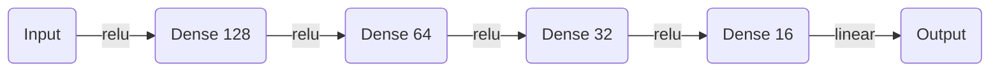
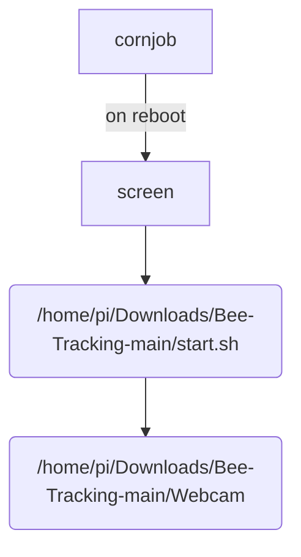

## Device networking

done through zerotier network

## ML Pipeline

### ML



model is fitted over past 360 datapoints. this behavior can be adjusted in `process_data.py:14`

### Device configuration

when system starts for the first time, `start.sh` would create `env.sh` from `env.sh.template` and generate a random uuid as the serial number. because the serial number is random and long (128 bits), it is impossible to guess thus sufficient to authorize access to device.

the env.sh would then be executed inline to set environment variables
device location currently need to be configured manually. In future, IP address of the device can be used to infer estimated location.
It should only have 2-3 digits after the decimal point or be of a random location near by. as the location is only used to obtain weather data.

## Service startup

Start sequence



## crontab

```cron
@reboot screen -dmS sdp-beehive -L -Logfile /home/pi/sdp-beehive.log /home/pi/Downloads/Bee-Tracking-main/start.sh
```

`@reboot` runs the following command on reboot

> GUI are not loaded at the time of execution, so any code involving gui would give error.

## screen

`screen -dmS sdp-beehive` runs the following command in daemon mode in a detached session.

- To list all sessions (check whether the service is up): `screen -ls`
- To view logs/kill session: `screen -r` (to detach from that do ctrl-A followed by ctrl-D without releasing ctrl)
- Log file will be printed to `/home/pi/sdp-beehive.log`

## start.sh

to change startup process, `start.sh` should be modified.
